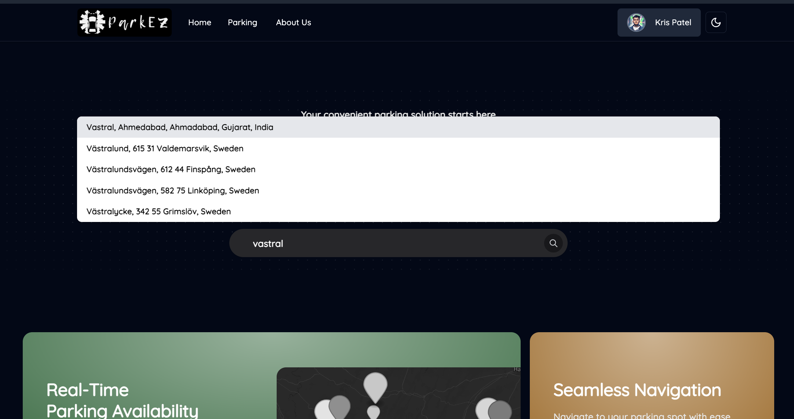
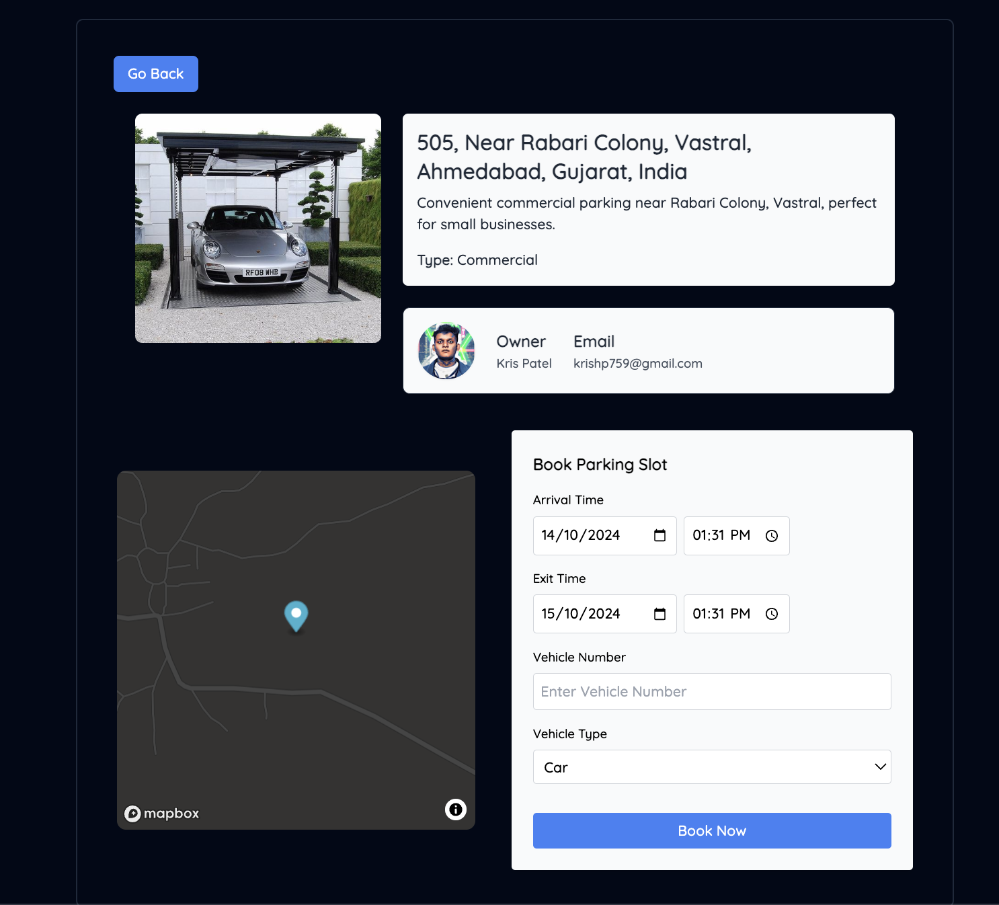
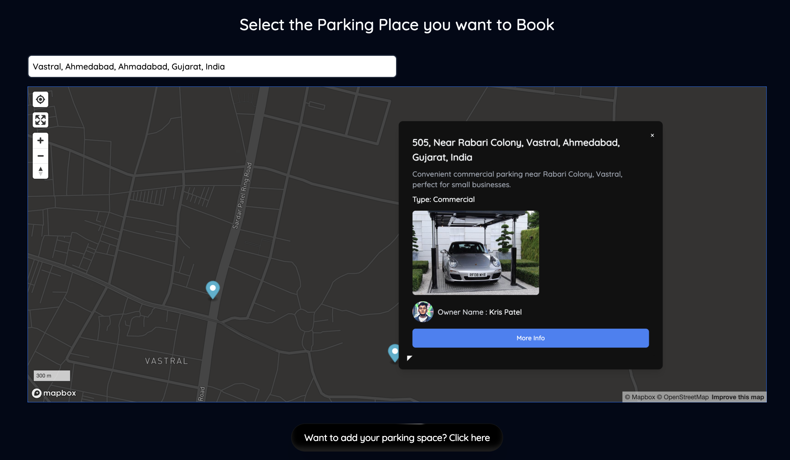

# ParkEz

ParkEz addresses the common challenge of finding available parking spaces in urban environments, where parking scarcity is a significant concern for drivers. This web application serves as a user-friendly platform that enables individuals to locate nearby parking areas while also allowing property owners to list their available spaces for rent. 

## Table of Contents
- [Tech Stack](#tech-stack)
- [Screenshots](#screenshots)
- [Installation](#installation)
- [Environment Variables](#environment-variables)
- [Usage](#usage)
- [License](#license)

## Tech Stack
- **Frontend**: TypeScript, React.js
- **Backend**: Node.js, Express
- **Database**: MongoDB Atlas
- **Authentication**: Firebase
- **Map Integration**: Mapbox API
- **Version Control**: Git
- **Deployment**: Vercel, Render
- **Payment Gateway** : Stripe

## Screenshots









## Installation

### Prerequisites
- [Node.js](https://nodejs.org/) (v14 or above)
- [MongoDB Atlas](https://www.mongodb.com/cloud/atlas) for database hosting
- [Firebase Account](https://firebase.google.com/) for authentication
- [Mapbox Account](https://account.mapbox.com/) for API keys

### Clone the Repository
```bash
git clone https://github.com/Kris0011/ParkEz.git
cd ParkEz
```

### Install Dependencies
```bash
# Install backend dependencies
cd backend
npm install

# Install frontend dependencies
cd ../frontend
npm install
```

## Environment Variables

Create a `.env` file in both the `backend` and `frontend` directories and add the following variables:

### Backend
```
PORT=5000
MONGODB_URI=your_mongodb_connection_string
FIREBASE_CONFIG=your_firebase_config_json
```

### Frontend
```
VITE_MAPBOX_TOKEN=your_mapbox_api_token
VITE_FIREBASE_CONFIG=your_firebase_config_json
```


## Usage

### Running the Backend
```bash
cd backend
npm start
```

### Running the Frontend
```bash
cd frontend
npm run dev
```

The application will be available at `http://localhost:5173`.

## License

This project is licensed under the MIT License - see the [LICENSE](LICENSE) file for details.

---

Happy parking with ParkEz! 🚗🅿️
